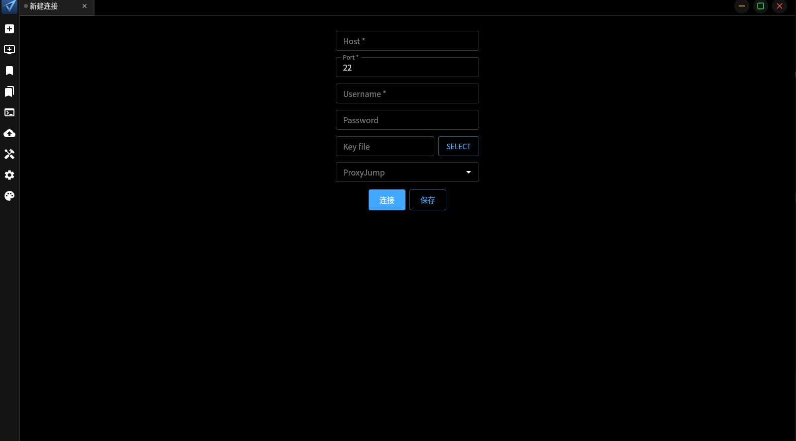
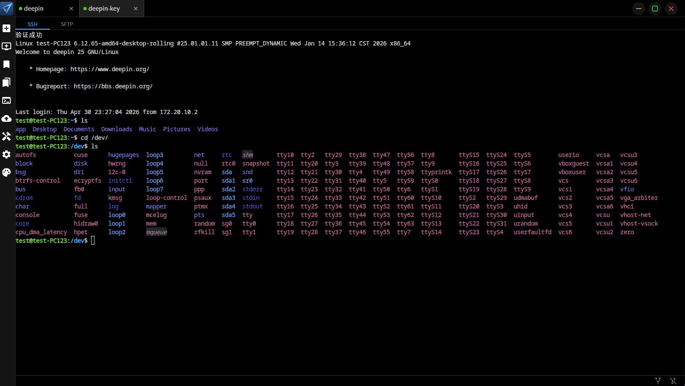
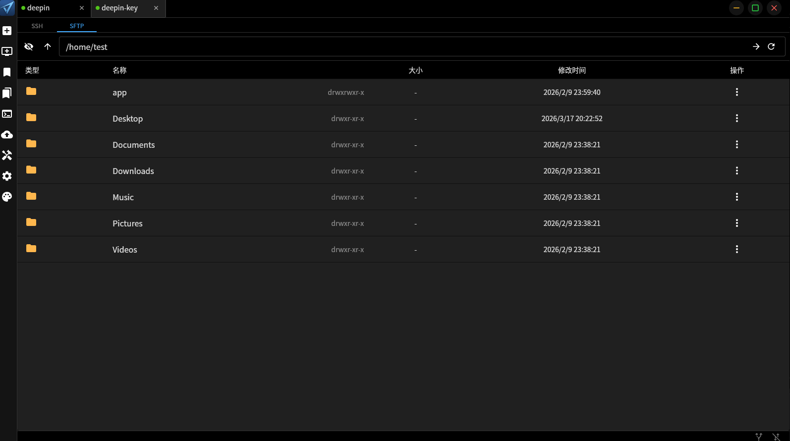
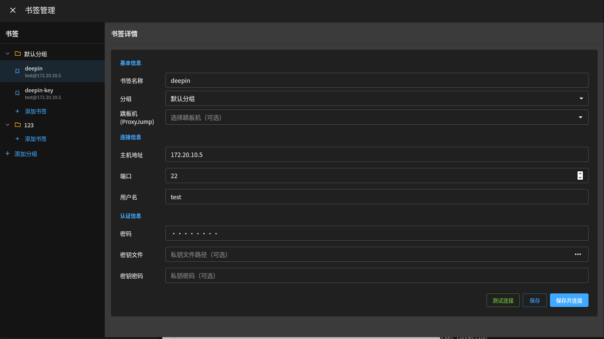
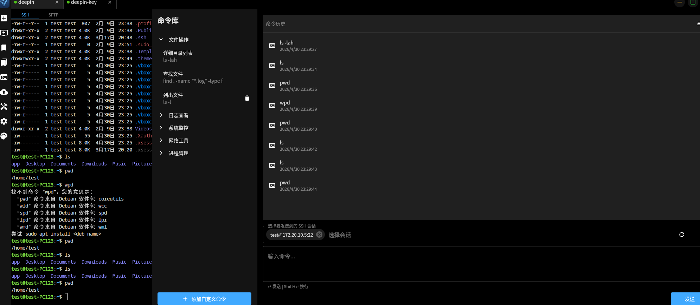

# Vexo — 跨平台 SSH & SFTP GUI 客户端

[](https://golang.org)
[](https://wails.io)
[](LICENSE)

一款基于 Go 和 Wails v3 构建的现代化、跨平台 SSH 和 SFTP 桌面 GUI 应用。

---

## 📖 简介

**Vexo** 是一个简洁、响应迅速的桌面应用程序，将 SSH 和 SFTP 的强大功能带到您的指尖——无需离开原生 GUI 环境。使用 [Wails v3](https://wails.io) 和 Go 构建，Vexo 原生运行于 Windows、macOS 和 Linux，为开发人员和系统管理员提供统一的远程访问和文件管理工具。

设计理念：清爽简洁、专业可靠、护眼舒适

---

## ✨ 特性

- 多标签切换，复制，刷新
- SFTP 文件浏览器，支持上传、下载、删除、重命名文件
- 文件传输任务管理
- 会话书签管理，快速连接常用服务器
- 支持文件夹分类管理书签
- 主题切换支持，多种主题方案：亮色模式、暗色模式、蓝夜模式、护眼模式
- 支持 Zmodem 文件传输协议（rz/sz）
- 命令库功能，建立自己的命令库，一键发送到多个会话
- SSH 端口转发/隧道，支持本地转发、远程转发、SOCKS5 动态代理
- 自建数据远程备份功能，在多台设备间恢复配置，本地加密，支持历史版本恢复
- 自动更新检查，及时获取最新版本

---

## 📸 截图

> 以下截图展示了 Vexo 的主要界面：

### 主界面 - SSH 终端


_多标签 SSH 终端界面_


_多标签 SSH 终端界面_

### SFTP 文件浏览器


_直观的文件管理界面_

### 书签管理


_服务器连接配置管理_

### 命令库



---

## 📄 许可证

本项目采用 [Apache License 2.0](LICENSE) 许可证。

```
Copyright 2024 Vexo Contributors

Licensed under the Apache License, Version 2.0 (the "License");
you may not use this file except in compliance with the License.
You may obtain a copy of the License at

    http://www.apache.org/licenses/LICENSE-2.0

Unless required by applicable law or agreed to in writing, software
distributed under the License is distributed on an "AS IS" BASIS,
WITHOUT WARRANTIES OR CONDITIONS OF ANY KIND, either express or implied.
See the License for the specific language governing permissions and
limitations under the License.
```
