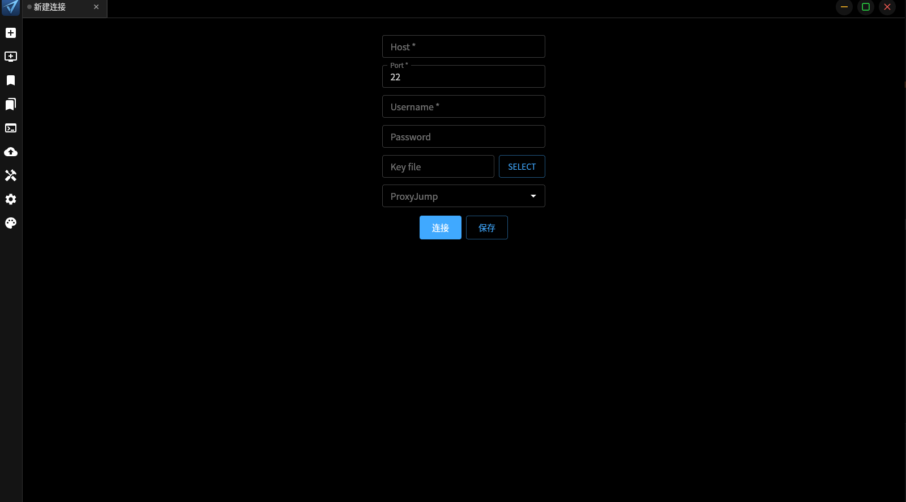
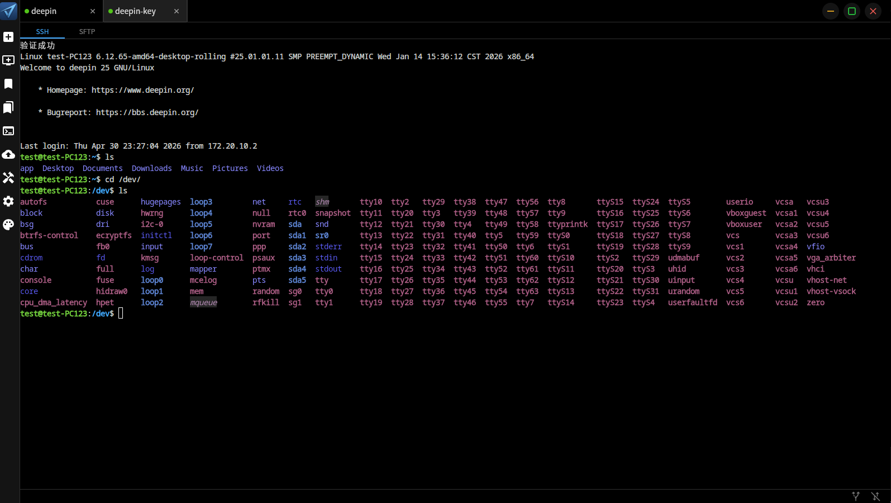
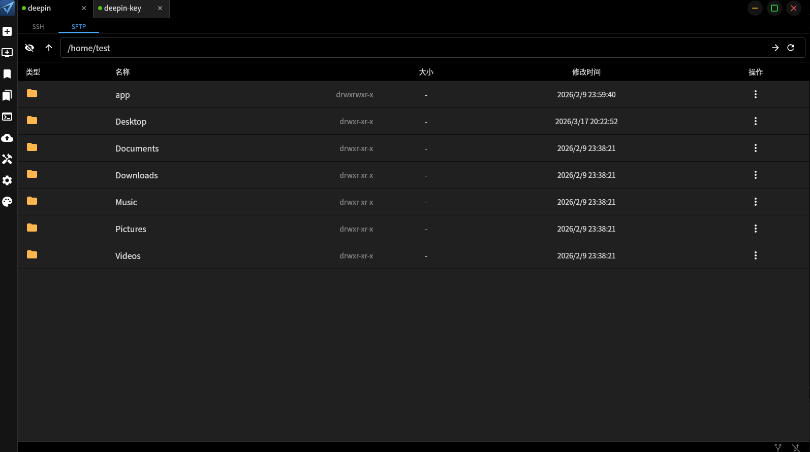
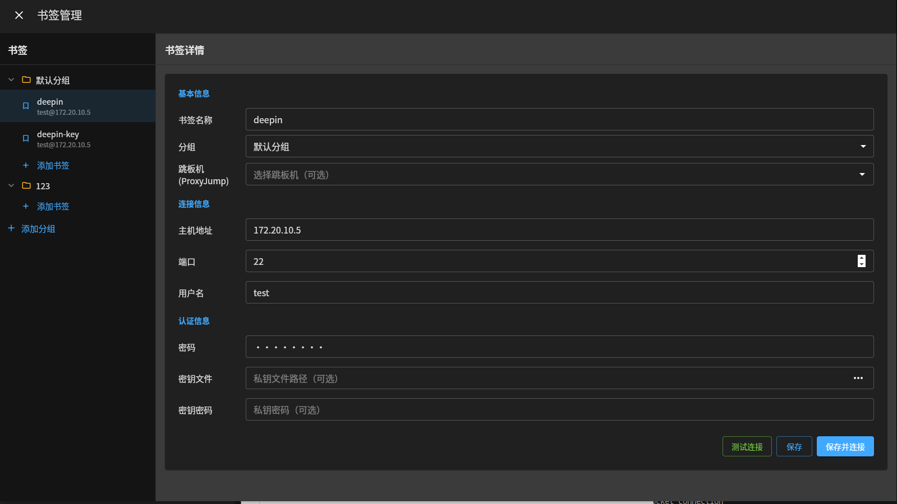
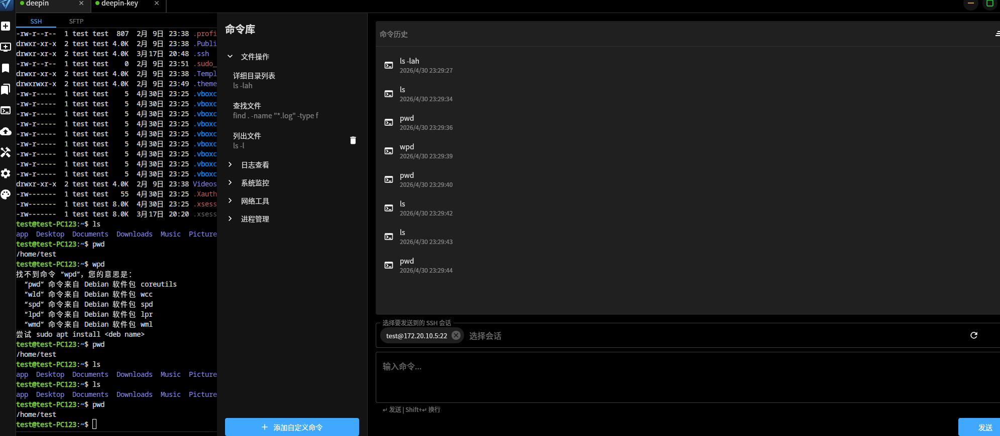
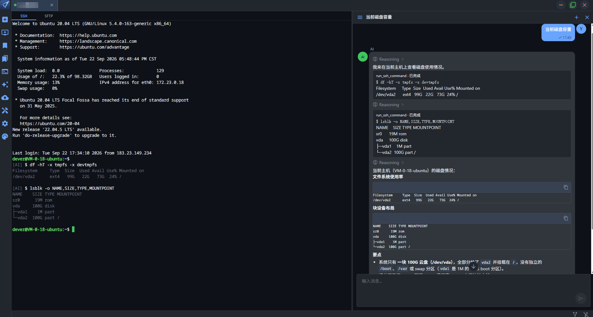

# Vexo — 跨平台 SSH & SFTP GUI 客户端

[](https://github.com/ilaziness/vexo/actions/workflows/release.yml)
[](https://github.com/ilaziness/vexo/releases/latest)
[](https://github.com/ilaziness/vexo/releases)
[](https://go.dev)
[](https://wails.io)
[](LICENSE)

一款基于 Go 和 Wails v3 构建的现代化、跨平台 SSH 和 SFTP 桌面 GUI 应用。

---

## 📖 简介

**Vexo** 是一个简洁、响应迅速的桌面应用程序，将 SSH 和 SFTP 的强大功能带到您的指尖——无需离开原生 GUI 环境。使用 [Wails v3](https://wails.io) 和 Go 构建，Vexo 原生运行于 Windows、macOS 和 Linux，为开发人员和系统管理员提供统一的远程访问和文件管理工具。

---

## ✨ 特性

**连接与认证**

- SSH 登录：密码、私钥、SSH Agent（Windows Pageant / macOS·Linux `SSH_AUTH_SOCK`）、OpenSSH 证书、keyboard-interactive（OTP/二次验证）
- 应用内生成 SSH 密钥对，公钥可复制，私钥按主密码加密保存或导出
- 敏感信息主密码保护（Argon2id + AES-GCM，进程内 Vault）
- ProxyJump 跳板连接；Agent 转发（`ForwardAgent`），远端可继续使用本机 Agent 密钥
- 经 HTTP / SOCKS5 代理拨号（全局或书签 inherit / none / custom）
- 连接保活与自动重连；主机密钥首次确认、变更对比与 known_hosts 管理
- 导入、导出 `~/.ssh/config`；书签可配置启动命令、环境变量与 `TERM`
- SSH 端口转发：本地转发、远程转发、SOCKS5 动态代理

**终端**

- 多标签切换、拖动、复制、刷新；终端内搜索（快捷键 / 右键）
- 会话日志：右键开始/停止记录，将终端输出保存到本地文件（不记录 stdin）
- Zmodem（rz/sz）：终端内自动识别传输协议，弹窗选择目录或文件完成收发，进度显示在终端

**SFTP 与书签**

- SFTP 文件浏览器：上传、下载、删除、重命名；修改远程权限与属主（chmod / chown）
- 断点续传；传输失败可重试；未完成任务队列持久化（按书签恢复）
- 多选批量下载与删除；传输任务管理
- 书签管理与分组，快速连接常用服务器

**效率与运维**

- 命令库：自定义命令片段，一键发送到多个会话
- 主题切换：亮色、暗色、护眼等方案
- 加密远程备份与多设备恢复，支持历史版本
- 自动更新检查，自动下载安装新版
- AI 侧边栏：分析问题并协助执行命令

---

## 📸 截图

> 以下截图展示了 Vexo 的主要界面：

### 主界面 - SSH 终端


_多标签 SSH 终端界面_


_多标签 SSH 终端界面_

### SFTP 文件浏览器


_直观的文件管理界面_

### 书签管理


_服务器连接配置管理_

### 命令库



### AI侧边栏



---

## 📄 许可证

本项目采用 [Apache License 2.0](LICENSE) 许可证。

```
Copyright 2024 Vexo Contributors

Licensed under the Apache License, Version 2.0 (the "License");
you may not use this file except in compliance with the License.
You may obtain a copy of the License at

    http://www.apache.org/licenses/LICENSE-2.0

Unless required by applicable law or agreed to in writing, software
distributed under the License is distributed on an "AS IS" BASIS,
WITHOUT WARRANTIES OR CONDITIONS OF ANY KIND, either express or implied.
See the License for the specific language governing permissions and
limitations under the License.
```
